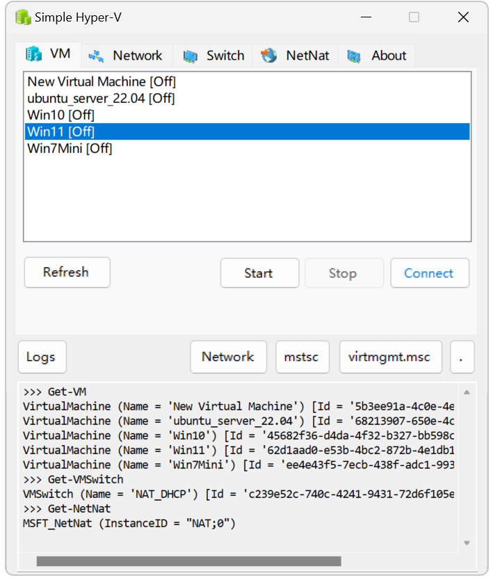
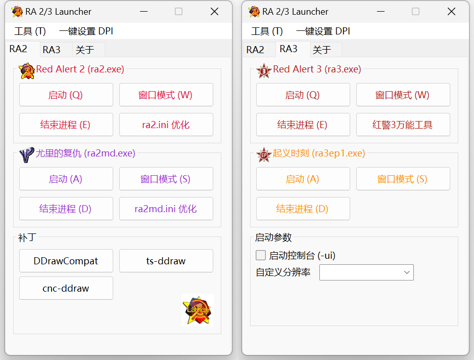
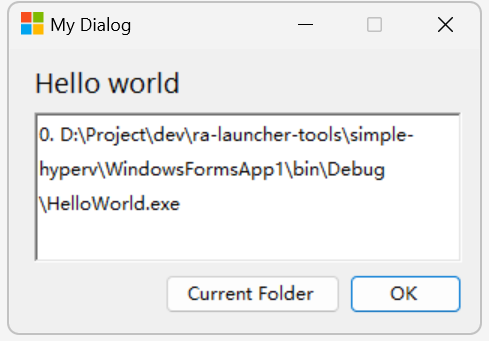

# WinForm 小工具

使用 .NET Framework 4.7.2 开发的轻量级小工具，单文件 exe 大小不超过 5 MB ！

## Simple Hyper-V 管理器

解决 Hyper-V 启动过慢的问题，并增加一些 GUI 管理实用工具。功能如下：

- 支持虚拟机列表、启动、暂停、恢复、关机、强制关机，一键调出虚拟机设置
- 支持创建虚拟机、快速打开Hyper-V、优化磁盘空间、编辑网络和虚拟交换机
- 支持快速创建和管理交换机和NetNat网络（[Hyper-V 固定虚拟机网络 IP 地址 配网指南](https://canwdev.github.io/VM%E8%99%9A%E6%8B%9F%E6%9C%BA/Hyper-V/Hyper-V%20%E5%9B%BA%E5%AE%9A%E8%99%9A%E6%8B%9F%E6%9C%BA%E7%BD%91%E7%BB%9C%20IP%20%E5%9C%B0%E5%9D%80%20%E9%85%8D%E7%BD%91%E6%8C%87%E5%8D%97/
)）

## 红警2/3 启动器 · RA Launcher Remaster

Red Alert Launcher Tools (2023)

把此程序放在红警2/3文件夹内，即可使用。

项目目录：[ra-launcher-remaster](./ra-launcher-remaster/)，此程序使用 Visual Studio 2022 开发，使用 WinForm 技术构建，打包后只有几百KB。

## HelloWorld

WinForm 代码初始化模板

